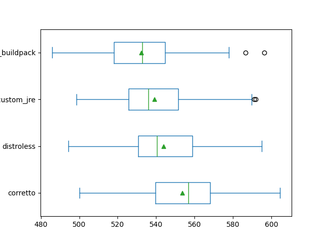

# jvm x distroless

## プロポーザルの変更点

- Java のバージョンが 21 -> 25

## 導入

### Docker はローカルでもクラウドでも環境をそろえられる

- 12 factors app

### JVM のイメージは重い

- 環境構築時の pull 時間
- 新規開発時の push 時間
- JVM の理念と被ってる

### 計量イメージを使って問題解決

- distroless を使おう

## distroless の Java での使い方

### corretto

- 基本的な Java アプリの Dockerfile

### distroless

- JVM の種類
- JVM 入り distroless を使う場合の Dockerfile
- `CMD ["app.jar"]` の理由

### distroless x custom JRE

- custom JRE
- BOOT-INF
- Dockerfile

### buildpacks x distroless x custom JRE

- runImage
- environment.BP_JVM_JLINK_ENABLE
- environment.BP_JVM_JLINK_ARG

## 比較

### サイズ

圧縮後サイズ

| Image                           |      Size |
|:--------------------------------|----------:|
| corretto                        | 265.43 MB |
| distroless                      |  94.62 MB |
| distroless-custom-jre           |  72.79 MB |
| distroless-custom-jre-buildpack |  87.92 MB |

### コンテナ実行環境での起動時間

#### コンテナ起動時間とイメージサイズの関係

- pull 時間 + アプリ起動時間 = コンテナ起動時間

#### 実験手法

- ECR + ECS Express
- デプロイ方式: カナリアデプロイ

#### 実験結果

- corretto を使ったイメージが遅かった
- buildpacks を利用して作ったイメージが早かった

#### 考察

- Dockerfile 形式同士の比較から、サイズは起動時間に寄与する
- buildpacks の結果から、サイズだけが起動時間に寄与する訳ではない

## distroless を使用する場合にやってほしいこと

### ローカルから docker で起動しておく

-ローカルとクラウドの実行環境を揃える
- compose.yaml を書いておく
- アプリ起動に必要な環境変数もまとめられる -> 12 factor app
- build jar -> compose up or compose up --build

### コンテナレベルのブラックボックステスト

- アプリの異常だけでなくコンテナの異常を検知できる
- docker compose プラグインでテスト実行前の compose up と実行後の compose down を自動化

### リモートデバッグ可能

- custom JRE を使用している場合は、jdk.jdwp.agent を追加
- compose.yaml で 5005 ポートの解放と JAVA_TOOL_OPTIONS の環境変数を設定

### ローカルのヘルスチェックが難しい

- Dockerfile や compose.yaml のヘルスチェックはコンテナ内でコマンドを実行する
- curl がないためヘルスチェックができない
- クラウドの場合は問題ないことが多いので気にしていない

## まとめ

- イメージサイズの軽量化はこれらの時間短縮に寄与する
  - ローカル環境での初回 pull
  - コンテナレジストリへの初回 push
  - コンテナ実行環境での起動時間
- 起動時間の短縮は、サイズだけではなくコンテナ構造も寄与する
- コンテナイメージを工夫する場合、常に distroless を使ってアプリを起動できるようにしておく
